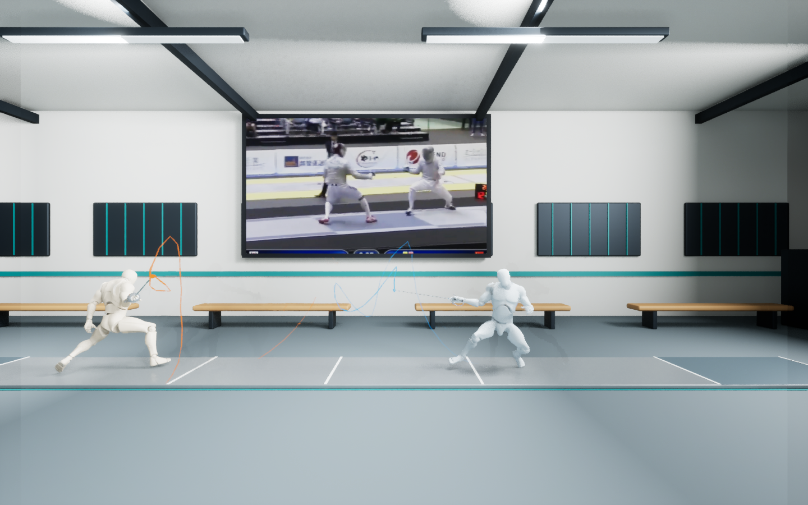
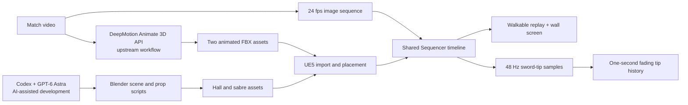

# Guan’s Fencing Club

### From match footage to an interactive 3D fencing replay

An FDE portfolio case study in integrating AI-assisted development, video-to-motion generation, procedural 3D modeling, and a real-time engine into one usable desktop experience.

[Explore the showcase](https://samguan2020.github.io/guans-fencing-club/) · [Run the UE project](docs/setup.md) · [Asset provenance](ASSET_PROVENANCE.md)

## The problem I chose to solve

Fencing actions happen quickly. A broadcast gives the viewer one camera perspective, while a useful observation tool should let them move around a replay, compare reconstructed movement with the source footage, and see the recent path of each sword tip.

I defined and iterated a prototype around that workflow: a walkable fencing club, two synchronized athletes on piste 1, a wall-mounted reference screen, and one-second colored tip histories. This is a technical demonstration; it has not been validated as a coaching or officiating system.

## My role: connecting the whole system

I directed the product requirements, selected and connected the tools, supplied the video and generated motion assets, and refined the experience through successive acceptance checks. I used AI assistance to build and debug the implementation, with explicit attention to what the resulting system could actually demonstrate.

| Layer | Tool and contribution | Evidence in this project |
| --- | --- | --- |
| AI-assisted execution | Codex, including Computer Use in my broader development workflow, plus Python and shell automation | Repeatable Blender/UE scripts and runtime validation reports; no Computer Use session recording is included |
| 3D development assistance | GPT-6 Astra assisted the 3D scene planning and implementation through Blender tooling | Procedural hall, sabre, screen, and trail generators; the model is not a native 3D asset exporter |
| Motion generation | I used DeepMotion’s Animate 3D API upstream to turn fencing footage into two character animations | Two supplied FBX inputs; the API client, requests, and credentials are not part of this repository |
| Environment creation | Blender generated the branded club and props | `SourceAssets/Hall/build_hall.py`, Blender and FBX assets |
| Runtime integration | Unreal Engine 5 imports and assembles the environment, skeletal animations, and replay | `build_ue_hall.py`, `add_duel.py`, `align_duel.py` |
| Observation features | A synchronized wall screen, hand-attached sabres, and colored tip histories | `add_tv_sabres.py`, `sample_sword_tips.py`, `add_tip_trails.py` |
| Delivery and verification | Local launchers, reconstruction scripts, and automated Play checks | `Play.cmd`, `OpenEditor.cmd`, `validate_*.py` |

The tool history above describes my workflow. The code checked into this project demonstrates the downstream asset integration, scene construction, playback, and validation. It does not claim to implement DeepMotion’s motion model or independently benchmark GPT-6 Astra’s 3D capabilities.

## System flow

## Where the integration work mattered

**Coordinate systems and motion.** Blender and UE use different scene conventions. I aligned units and placement, retained longitudinal movement, excluded the initial T-pose variant, and used an actor-position track to cancel lateral root drift so both athletes remain on the piste.

**Media reliability.** The initial video playback path produced a black screen in the tested configuration. The final implementation uses a 720p image sequence and Sequencer-managed playback. It repeats the last source frame once to align the 249-frame video with the 250-frame animation loop, and explicitly enables looping to avoid getting stuck on the final frame.

**Readable movement.** I added right-hand sabres, blue/orange tip markers, and trails that fade over one second. The trails are sampled from the existing 3D sword motion and driven by the replay clock. Restarting a loop clears the visible history instead of drawing a spurious line across the reset.

**Observable delivery.** Automated UE Play checks verify actor placement, animation movement, video timing, sword attachments, trail-clock alignment, and loop behavior. The project was also moved to a new drive and tested again, exposing portability as a delivery requirement.

## Measured result and boundaries

| Measure | Recorded result |
| --- | --- |
| Replay | Two athletes, 24 fps, 250-frame loop (~10.42 seconds) |
| Tip history | 48 Hz precomputed samples; one-second fade |
| Latest recorded steady-state video/sequence time difference | Maximum ~35.7 ms in the sampled Play test, below one 24 fps frame |
| Test environment | Windows, UE 5.8.3, GTX 1050 Ti |

The timing result comes from `tip_trails_validation.json` after relocation on September 29, 2026. It measures sampled playback clocks, not end-to-end display latency or motion-reconstruction accuracy, and is not a cross-hardware guarantee.

The sabres are approximate geometry attached to reconstructed wrists. Their trails are **3D tip visualization, not measured real-world blade tracking**. Foot sliding, pose errors, and imperfect grips can remain. Trails must be regenerated if the animation, placement, or sword geometry changes. Audio is currently muted. The browser showcase contains screenshots and an explanatory interaction; the full experience runs locally in UE.

## Run locally

1. Install the matching Unreal Engine **5.8** version and Git LFS, then obtain the project and authorized assets.
2. Open `GuansFencingClub.uproject` in UE, or configure `UE_EDITOR` in the launchers for your engine installation.
3. Run `Play.cmd`. Use **W/A/S/D**, the mouse, and **Space** to explore.

Read [the setup guide](docs/setup.md) before rebuilding. `build_ue_hall.py` replaces the base level; later integration steps must be reapplied. Upstream DeepMotion generation requires a separate account and authorized footage. The included runtime has no DeepMotion API dependency.

## Repository and publishing

`Config/`, `Content/`, the `.uproject`, Python scripts, and `SourceAssets/` make up the desktop project. `docs/` is a standalone static showcase that can be served through GitHub Pages. The setup guide includes browser-preview instructions. `Saved/`, `Intermediate/`, and derived caches are intentionally excluded from Git; `.gitattributes` assigns large authoring assets to Git LFS.

The project owner confirmed permission to publish the supplied video, animation assets, and associated showcase material on September 29, 2026. No blanket license is assigned to third-party material; see [provenance](ASSET_PROVENANCE.md).

## References

- [GPT-6 Astra](https://developers.openai.com/api/docs/models/gpt-6-astra): reasoning, coding, and tool use supporting the AI-assisted workflow.
- [OpenAI Computer Use](https://developers.openai.com/api/docs/guides/tools-computer-use): browser and desktop interaction; availability is separate from the evidence included here.
- [DeepMotion Animate 3D REST API](https://github.com/DeepMotion/Animate-3D-REST-API): upstream video-to-animation interface.

Next engineering steps: a documented DeepMotion ingestion client, user-controlled pause/scrub/speed, replaceable datasets, and quantified motion-quality evaluation. These are future work, not implemented features.
